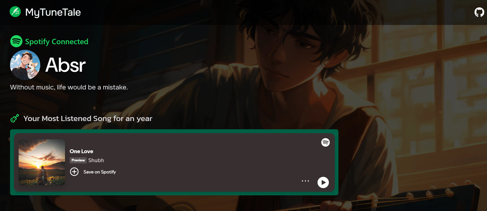
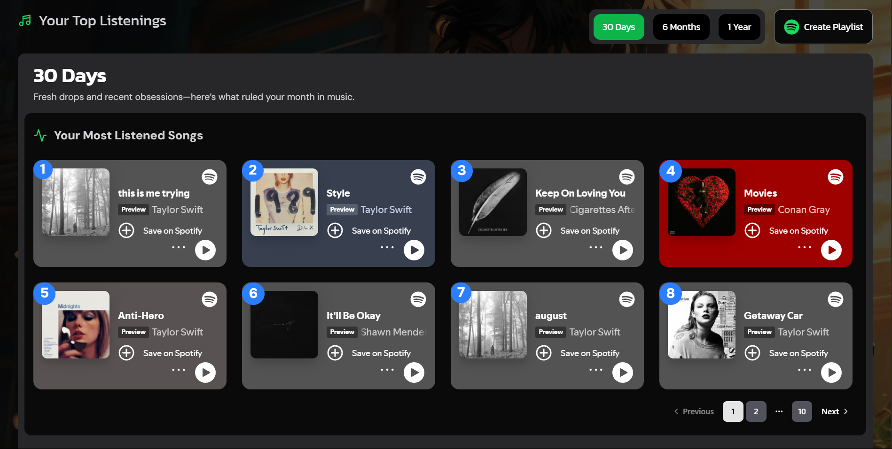
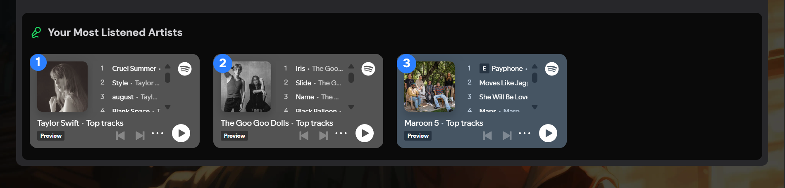
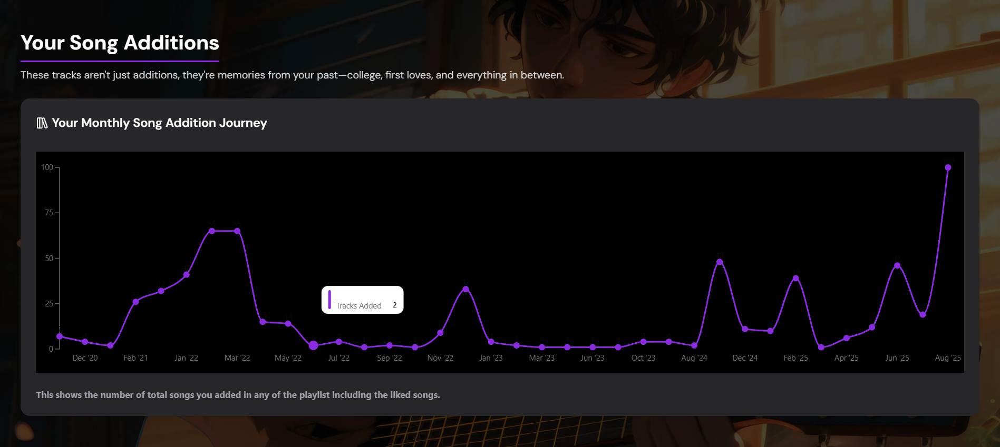
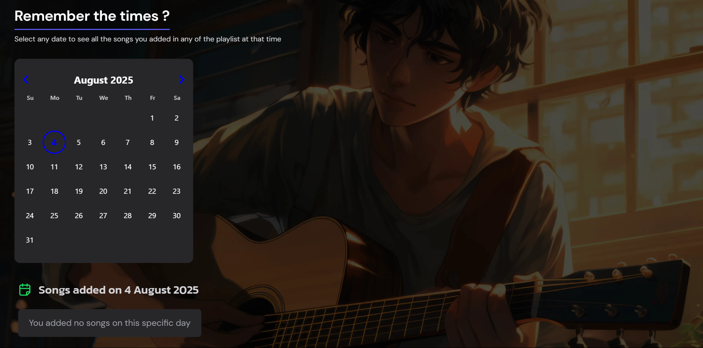
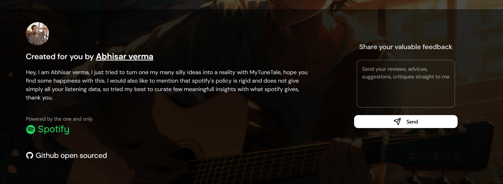

# MyTuneTale 🎵  

[🔗 Visit MyTuneTale Website](https://mytunetale.pythonanywhere.com)  

  
  
  
  
  
  

---

## 📖 Story Behind This Project  

I recently learned *React, and it felt **awesome**  
To practice and get comfortable with it, I decided to build something on my own — and that’s how ***MyTuneTale*** was born.  

Unfortunately, ***Spotify only gives unlimited user access to approved organizations, so this website won’t work for everyone yet.*** But for now, I’ve disabled the real authentication flow and set it up so you’ll always see **my Spotify data**. This way, you can still explore how it works and get the full look & feel.  

---

## 🛠 Tech Stack  

- **HTML**  
- **Hybrid CSS approach**  
  - Traditional CSS (layout)  
  - Tailwind CSS (colors & backgrounds)  
  - Shadcn components (charts & popovers)  
- **React**  
- **Supabase** (database)  
- **Spotipy** Python library (Spotify API)  
- **Python** & **Django** (backend)  
- **PythonAnywhere** (hosting provider)  

---

## ✨ Features  

- **Your top tracks & artists** in 3 timeframes — short term, medium term, long term  
  > (When I saw my most-listened song for the whole year, I was shocked... and maybe a little guilty 😅)  
- **Listen directly** to your top tracks with Spotify iframes  
- **Your monthly song addition journey with a line chart** — from the start of your Spotify account until now  
  > (I can clearly see the months when I met that girl and my song additions spiked 📈)  
- **Music calendar** — pick any date to see all the songs you added that day or month, in any playlist (and listen right there)  

---

## 📚 What I Learned  

- Implemented **Spotify Authorization** for new accounts  
- Connected and integrated with **Supabase** to store user data  
- Designed a backend flow:  
  1. Check if user’s data exists in DB  
  2. If yes, return it  
  3. If data is older than *5 days*, return None so fresh data is fetched  
- Built a **custom React hook** to fetch multiple datasets (top tracks, top artists, playlists) in parallel  
- Implemented **IndexedDB caching** so data loads fast without hitting the backend every time  
- Solved iframe performance issues:  
  - Initially loaded all iframes at once → site lagged  
  - Switched to **Shadcn pagination** (8 songs per page) → site became smooth  

---

## 🙌 Final Thoughts

This project helped me connect code with something I love deeply — music. I hope you enjoy exploring it as much as I enjoyed building it.

You can send your reviews, advices, suggestions, or critiques straight to me from the footer of the website where i have put a feedback box.

> Thanks for checking out MyTuneTale!

---